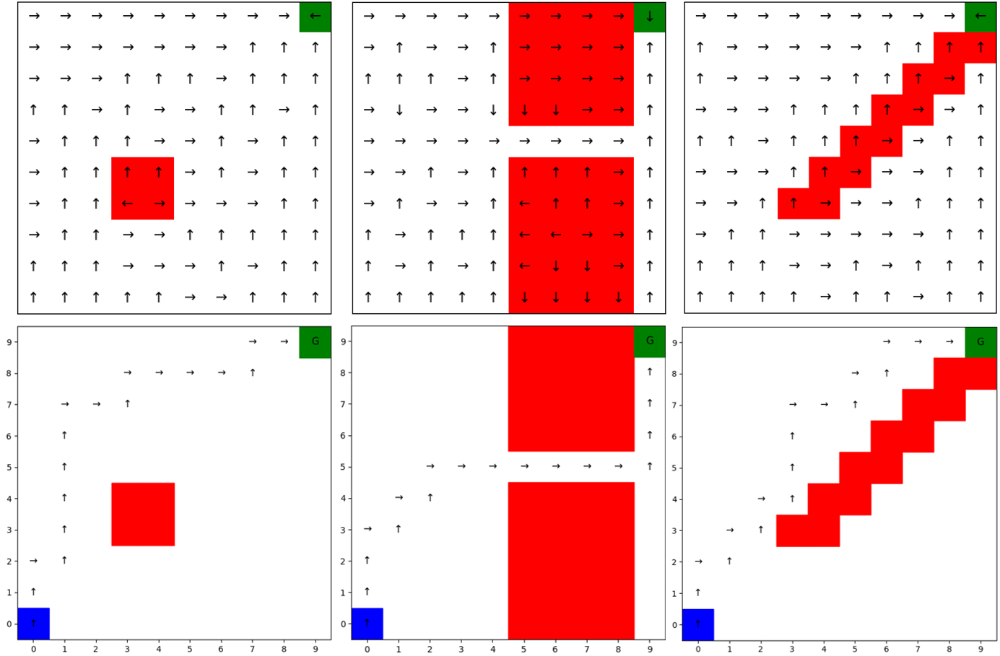
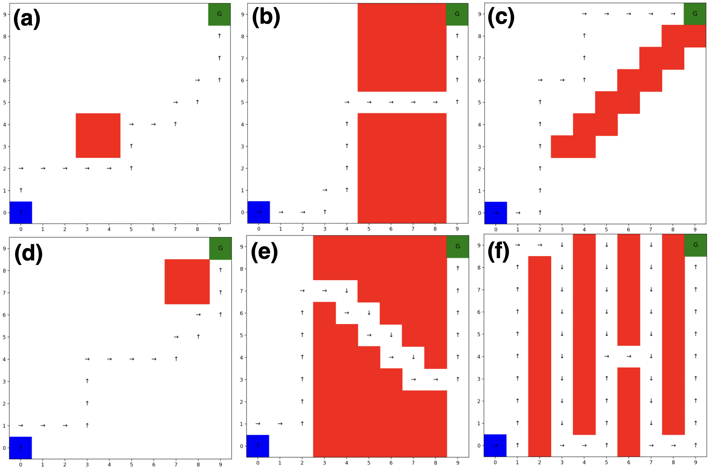
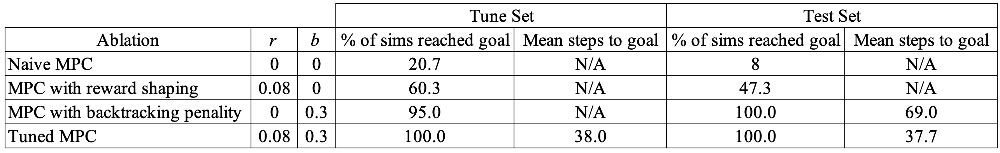

# Q-Learning and Model Predictive Control for Drone Wildfire Response
## AA228/CS238 Final Project - Ankush Dhawan, Mark Leone, Chris Copans

In this project, we explore using Q-Learning and Model Predictive Control (MPC) for a simulated environment where a drone must respond to a wildfire. 

The agent must explore a variety of maps, shown below. We model the applied problem where the agent occupies a single state on a 10 by 10 grid, and must traverse a grid world where there are a variety of obstacles along the way. The blue region is the start state, red regions refer to obstacles with negative rewards, and the green region refers to the goal state with a positive reward.

### Q-Learning
From implementing Q-Learning, the agent explored the maps with the below results. This offline planning method required that the agent has knowledge of the environment, corresponding to an exploration phase of the entire map in this implementation.

### Model Predictive Control
Since a drone responding to a wildfire may not have full observability of the entire environment, we explore using MPC for online planning of the path. This is divided into two phases, where MPC generates an offline plan with a limited horizon (in this case only the cardinal direction neighborhood states), and then executes the optimal action from that plan in an online manner. 

We perform ablations of this MPC method for including reward shaping, backtracking penalties, and tuning parameters. The results of this are included in the following table: 

### Acknowledgements
We thank the entire AA228/CS238 teaching team for their instruction and support throughout the quarter. We would like to specifically thank Dylan Asmar and Michelle Ho for offering their insights in approach and methods during office hours, and Prof. Kochenderfer for his instruction throughout the quarter.

Checkout our full paper linked here: 

